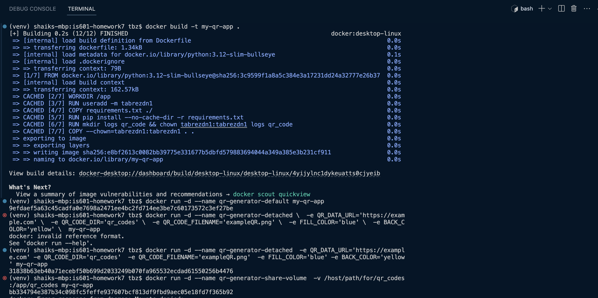

# Homework 7
## Shaik Tabrez

Combining Docker with Python to create a program that generates a QR code PNG file that
contains a URL. The QR code can be viewed with the camera on your phone to allow a user to click on it and send them to the target website.

## Submission Requirements:

1. Add the QR code image that links to your own GitHub homepage that you generate to the readme.md file, so that it appears below.

Please find the qr image below:

2.  Add an image of viewing the log of successfully creating the QR code below.

Please find the image of the logs below:

### Find below the usage of the docker commands in the image:

